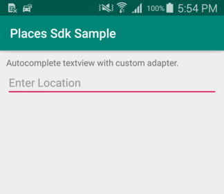
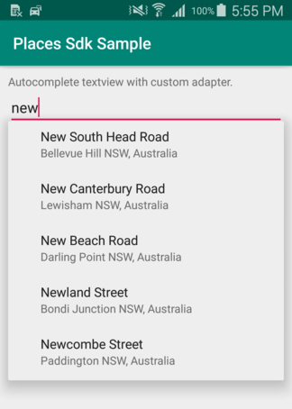
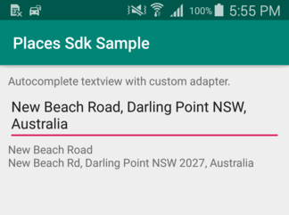

# Google Places SDK for Android

This repo demonstrate the use of the [Google Places SDK for Android][google] with custom auto complete adapter.

For simple Google Places SDK follow this [link][simple-google].

# Get Started
To get started, your app needs to meet two requirements:
- Enable google places sdk in [Google Console][console-google]
- Minimun Android SDK of 16 or higher

### Dependencies used
Add a dependency for the new SDK client library to your app-level build.gradle:

    implementation 'com.google.android.libraries.places:places:1.0.0'

## Screen Shoots

[google]: <https://developers.google.com/places/android-sdk/intro>
[simple-google]: <https://github.com/googlemaps/android-places-demos>
[console-google]: <https://console.cloud.google.com>
